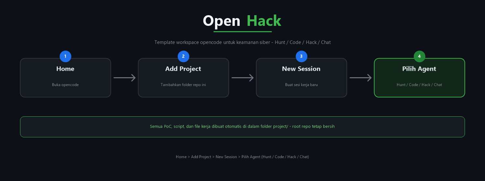

# OpenHack

Template workspace opencode untuk keamanan siber / penetration testing — berisi 4 agen khusus (Hunt, Code, Hack, Chat). Bukan project aplikasi: setiap project yang dikerjakan diletakkan di dalam `project/`.

## Agen

| Agen | Peran | Akses |
|---|---|---|
| **Hunt** (`/hunt`, default) | Recon & vulnerability hunting: footprint target, enumerate layanan, analisis CVE, laporan risiko | `bash` (mayoritas konfirmasi), `websearch`, `webfetch` |
| **Code** (`/code`) | Code review & exploit development: audit OWASP Top 10, trace data flow, PoC | `bash` + `edit` (konfirmasi) |
| **Hack** (`/hack`) | Exploitation & post-exploitation: validasi temuan, privilege escalation, lateral movement, operasi C2 | `bash` + `edit` (konfirmasi) |
| **Chat** (`/chat`) | Tanya jawab keamanan siber — tanpa akses tool | tidak ada (`bash`/`edit` deny) |

## Aturan Penggunaan

- **Hanya serang target dengan otorisasi eksplisit dari pemilik.** Tidak ada pengecualian.
- Prefer teknik non-destruktif; konfirmasi sebelum tindakan berisiko.
- Setiap temuan dilaporkan dengan: target, temuan, risk rating (Critical/High/Medium/Low), bukti, remediasi.

## Cara Penggunaan



1. **Home** — buka opencode.
2. **Add Project** — tambahkan folder repo ini sebagai project.
3. **New Session** — buat sesi kerja baru.
4. **Pilih Agent** — pilih agen sesuai kebutuhan (via TUI atau slash command):
   - `/hunt` untuk recon & vulnerability hunting (default)
   - `/code` untuk code review & exploit development
   - `/hack` untuk exploitation & post-exploitation
   - `/chat` untuk tanya jawab keamanan

> **Workspace:** semua PoC, script, dan file kerja dibuat otomatis di dalam
> folder `project/` (subfolder baru per target/engagement) agar root repo
> tetap bersih.

## Memulai

```powershell
# Clone repo ini, lalu jalankan opencode dari root
opencode

# Setiap session baru bekerja di dalam project/ (sub-project default)
# Pindah agen: gunakan slash command di TUI opencode (/hunt, /code, /hack, /chat),
# atau atur default_agent di opencode.json
```

## Struktur

```
OpenHack/
├── opencode.json              # config utama (default agent, username, permission)
├── README.md
├── assets/                    # ilustrasi & aset dokumentasi
│   └── usage-flow.png         # alur penggunaan (Home -> Add Project -> New Session -> Pilih Agent)
├── .opencode/                 # isi repo - definisi agen & command
│   ├── agent/                 # definisi 4 agen (hunt, code, hack, chat)
│   └── command/               # slash command: /hunt, /chat, /code, /hack, /recon
└── project/                   # sub-project default - isinya TIDAK masuk repo
    └── .gitkeep
```

## Catatan

- Config opencode **tidak hot-reload**: setelah mengubah `opencode.json`, definisi agen, skill, atau plugin — restart opencode agar berlaku.
- `project/` adalah tempat kerja per-user; isinya tidak dicantumkan di repo (lihat `.gitignore`). Tooling internal seperti C2 framework dan cryptovault dipindah ke sini setelah selesai dikembangkan.
- `node_modules` tidak disimpan; regenerasi via `npm install` di `.opencode/` jika perlu mengembangkan plugin.
